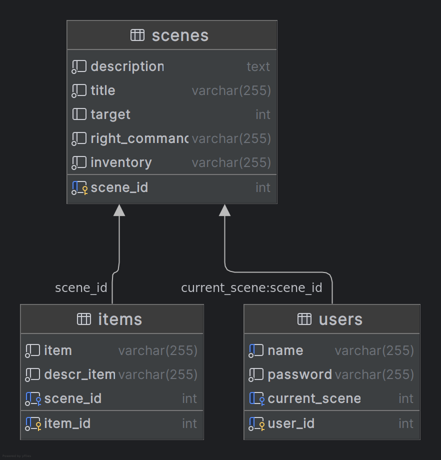

## DERBY'S GAME
#### TADS Módulo3

---

### TECNOLOGIAS

[](https://skillicons.dev)
___

#### BRANCHES

- Branch → **main:** projeto. <br>
- Branch → **tarefas:** trilhas e listas de exercícios.

---
#### BACKEND

- Banco de dados **MySQL**.
- Integração API **JAVA**.
- Frontend **JS**.


→ Link: https://felipetr00.github.io/TechAcademy3/

---
#### BANCO DE DADOS MySQL
<P>D.E.R.</P>



---

#### INICIAR O GOOGLE CHROME 

```bash
google-chrome --disable-web-security --disable-gpu --user-data-dir=~/chromeTemp
```
